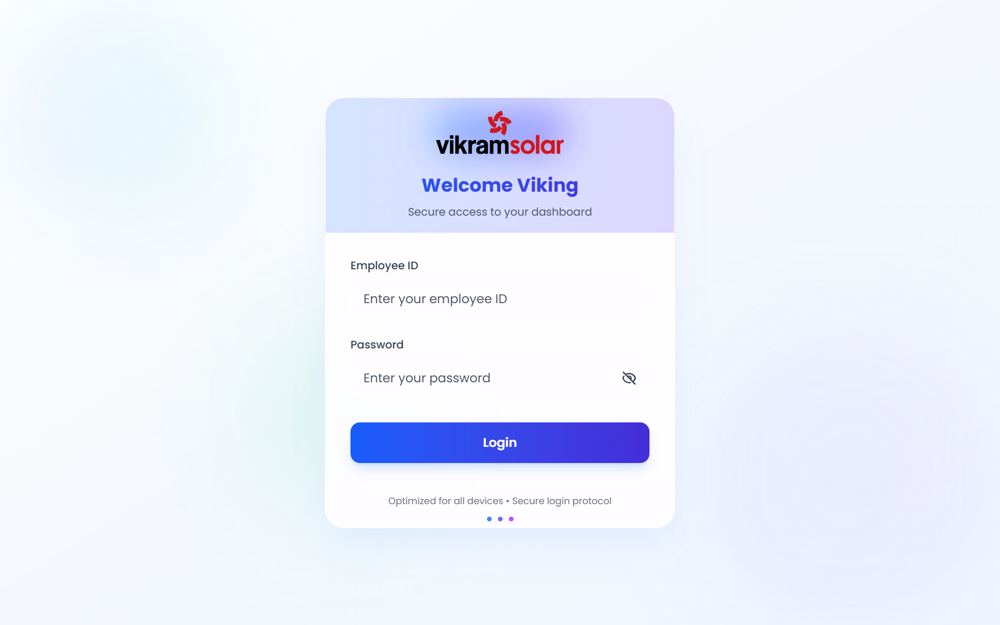
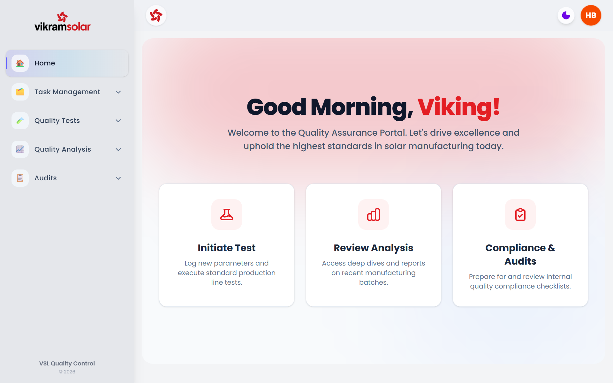
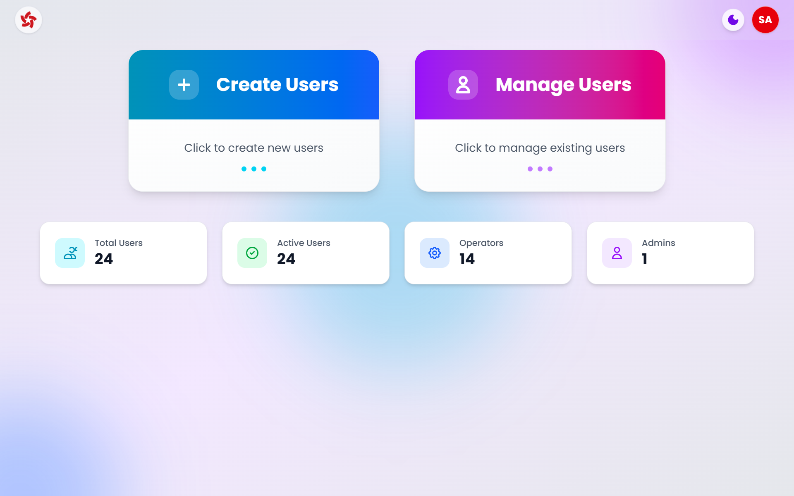
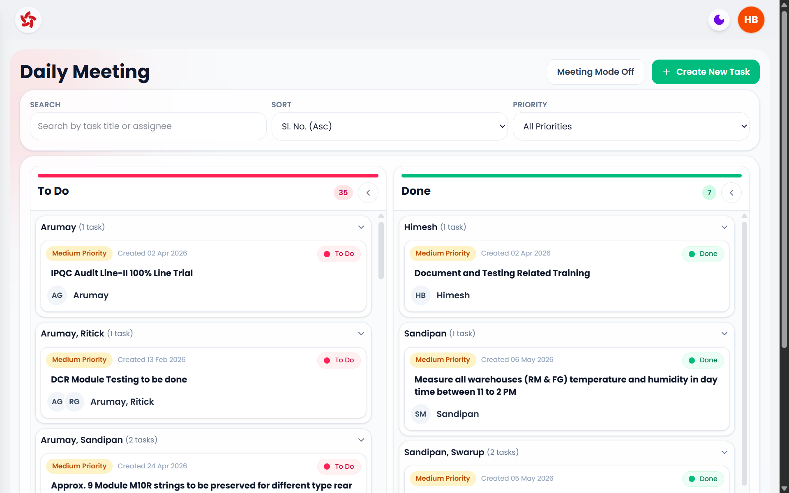
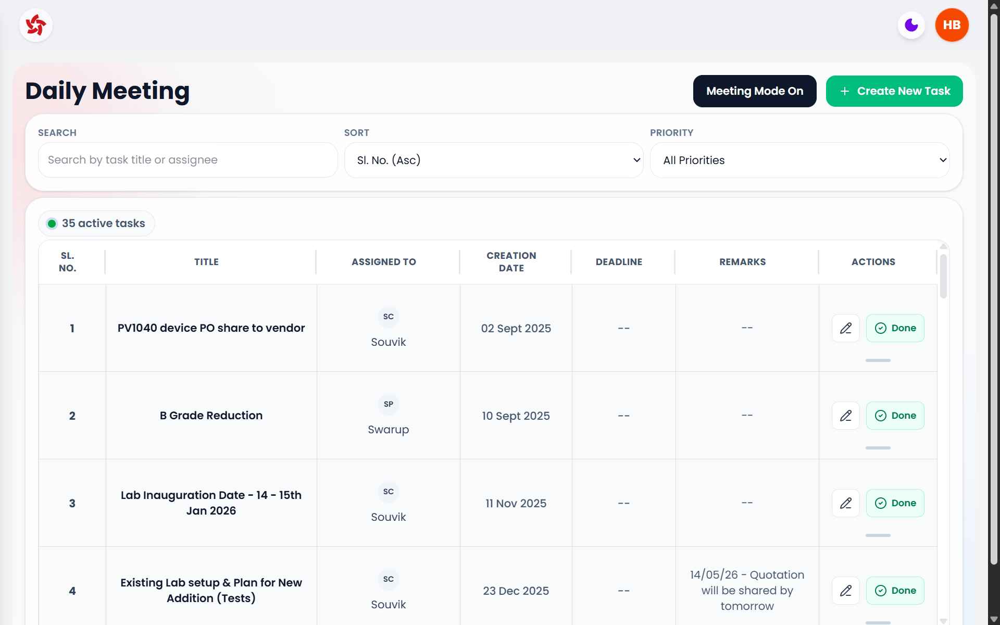
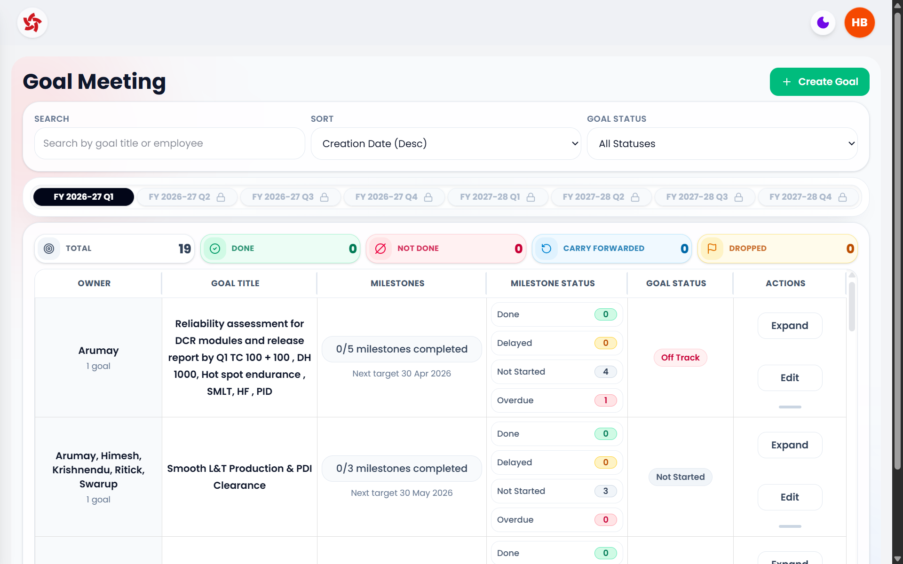
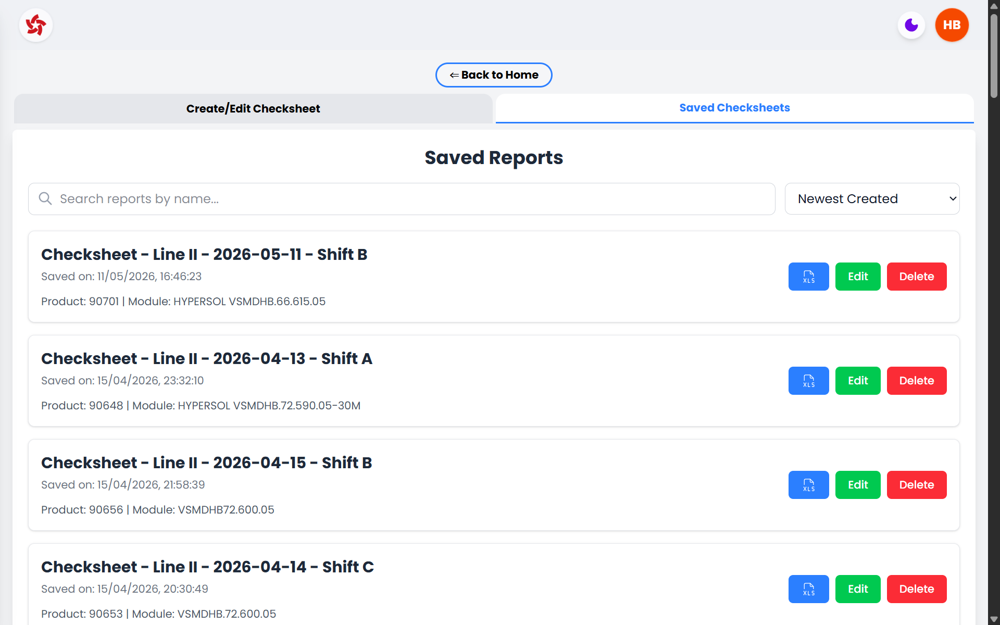
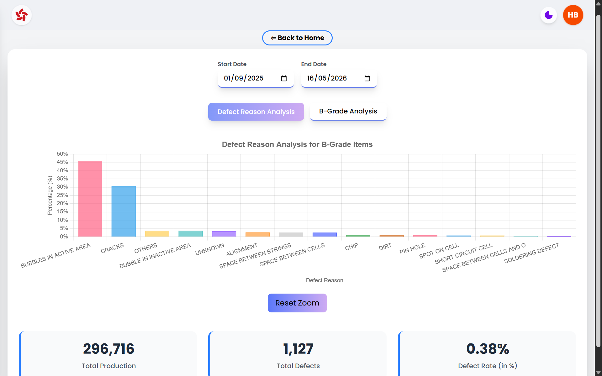
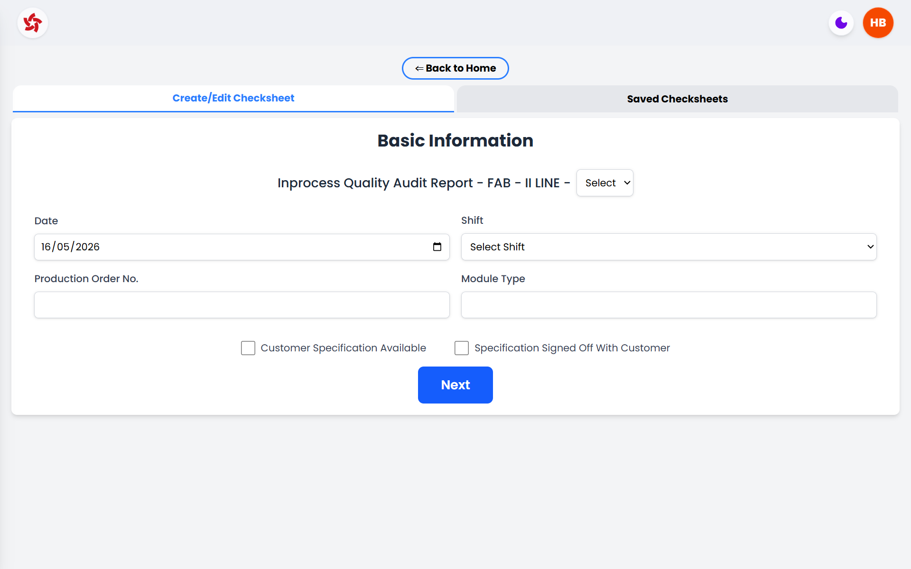
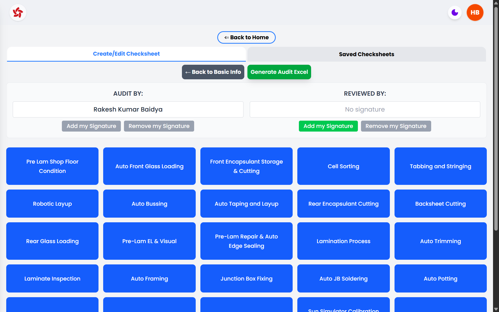

# VSL Quality Assurance Portal

## Executive Overview

The VSL Quality Assurance Portal is an internal enterprise platform for managing quality control activity across solar module manufacturing. It brings together production quality checks, line-wise inspection analytics, B-grade trend analysis, IPQC audit checklists, report generation, user administration, signatures, daily task tracking, and goal meeting governance in one controlled portal.

The platform is designed for quality teams, operators, supervisors, managers, auditors, product owners, and future maintainers who need a clear view of how quality data is captured, reviewed, approved, exported, and analyzed.

Its core business purpose is to reduce scattered manual records, standardize inspection workflows, preserve accountable sign-offs, and give management a faster view of production quality health.

## Platform Vision

The portal acts as a digital quality operating layer for manufacturing. Instead of treating checksheets, analysis dashboards, meeting actions, and audit records as separate activities, the system connects them into a single quality management experience:

- Operators capture test and checksheet observations close to production activity.
- Supervisors and managers verify, approve, and monitor compliance.
- Quality teams review trends, defects, rejection rates, and B-grade movement.
- Auditors can retrieve saved evidence and exported reports.
- Management can follow task closure, goal progress, and operational quality signals.

The result is a platform that supports traceability, ownership, faster review cycles, and stronger quality discipline.

## Key Functional Highlights

| Capability | Business Purpose |
| --- | --- |
| Secure login and role-based routing | Ensures users enter only the areas appropriate to their responsibility. |
| Admin user management | Allows controlled creation, update, activation, deactivation, and deletion of business users. |
| Digital signatures | Supports accountable preparation, verification, and approval in reports and checksheets. |
| Quality test reports | Captures process measurements, calculates summaries, stores reports, and exports Excel files. |
| Monthly checksheet workflows | Tracks daily shift-wise quality records with calendar views, monthly statistics, signatures, and Excel exports. |
| Production analysis dashboards | Shows rejection trends, defect counts, total production, and rejection rate by date range and line. |
| B-grade trend analysis | Separates B-grade volume and defect reasons for management review. |
| IPQC audits | Digitizes stage-wise audit observations across the manufacturing process. |
| Daily meeting board | Tracks actions from open to done using Kanban and meeting-table modes. |
| Goal meeting management | Tracks quarterly goals, milestones, lifecycle states, dropped goals, and carry-forward items. |

## Application Architecture Overview

The platform is built as a full-stack web application.

| Layer | Implementation |
| --- | --- |
| Frontend | React, TypeScript, Vite, Tailwind CSS, Chart.js, AG Grid, drag-and-drop tooling, Excel utilities. |
| Backend | FastAPI services in Python. |
| Database | MongoDB for users, tasks, goals, test records, checksheet records, and analytics collections. |
| File and report storage | AWS S3 for saved JSON report payloads and user signature images. |
| Report generation | Python Excel generators using workbook templates and structured payloads. |
| Routing | React Router on the frontend and FastAPI routers under `/api`. |
| Configuration | Environment-driven API URL, MongoDB, CORS, AWS, S3 bucket, and server port settings. |

### Data Flow

1. A user logs in with an employee ID and password.
2. The frontend stores the active session identity in browser session storage.
3. Screens call FastAPI endpoints using the configured `VITE_API_URL`.
4. MongoDB stores operational records and metadata.
5. AWS S3 stores larger report payloads and signature images where required.
6. Excel exports are generated by backend report generators and returned as downloadable files.
7. Analytics dashboards read prepared MongoDB collections created by backend extractors.

### Integration Landscape

| Integration | Usage |
| --- | --- |
| MongoDB | Primary operational data store for users, task board, goals, saved reports, daily entries, audits, and analytics. |
| AWS S3 | Stores report JSON payloads and signature image files; provides presigned URLs for signature display. |
| Excel generation | Produces formal downloadable quality records from current or saved report data. |
| Background extractors | Populate and refresh quality analysis, peel, and B-grade datasets for dashboard consumption. |
| Browser session storage | Maintains current user identity, role, employee ID, and working report draft state. |

The B-grade and quality analysis datasets are read from MongoDB collections, so upstream manufacturing or ERP ingestion can be introduced through the extractor layer without changing the user-facing dashboards.

## User Journey and Navigation Guide

After login, users see a protected portal layout with a header, theme toggle, account menu, and collapsible sidebar. The sidebar is the primary navigation surface.

| Navigation Area | Main Sections |
| --- | --- |
| Home | Welcome screen and entry point for quality activities. |
| Task Management | Daily Meeting and Goal Meeting. Hidden from Operator users. |
| Quality Tests | Adhesion, Frame Sealant Weight, Gel Content, JB Sealant Weight, Potting Ratio, RoT, SSH, Peel, Wet Leakage. |
| Quality Analysis | B-grade, FQC, Lam QC, Pre Lam, Pre-EL, Visual. |
| Audits | IPQC Audits. |
| Admin | User management only for Admin/System Administrator users. |

### Visual Walkthrough

#### Login and First Access

#### Home Dashboard & Sidebar Navigation

## Role-Based Access and Personas

| Persona | Access and Responsibility |
| --- | --- |
| Admin / System Administrator | Manages users, controls activation status, edits user details, and is protected from deletion or ordinary user edits. Admin users are routed to the admin console rather than the operational portal. |
| Manager | Full operational authority for task and goal management. Can create, edit, delete, move tasks, create goals, update details, drop goals, revive goals, carry forward not-done goals, and approve/sign applicable quality records. |
| Supervisor | Can access task and goal meeting areas, edit task remarks, update milestones, and verify or approve quality records where permitted. |
| Operator | Captures production and test observations, prepares reports, and adds prepared-by signatures. Operators do not access task and goal management screens. |
| Auditor / Functional Consultant | Uses saved reports, audit exports, dashboards, and signature trails to review evidence and process compliance. |

## Authentication and Account Management

Users authenticate with an employee ID and password. New users receive a generated default password based on their name initials and employee ID pattern, then must change it on first login.

Password rules require:

- Minimum 8 characters.
- At least one uppercase and one lowercase letter.
- At least one digit.
- At least one special character from `@`, `#`, `$`, `&`, `!`, `_`.

User account features include:

- First-login password reset.
- Change password from the header account menu.
- Logout confirmation.
- Light/dark theme preference saved to the user profile.
- Signature upload and removal for non-admin users.
- Signature image validation for JPG, JPEG, and PNG files.
- User status checks that prevent inactive users from logging in.

## Detailed Feature Walkthrough

## 1. Admin Console

The Admin Console is the control center for user lifecycle management.

### Purpose

To create and maintain controlled access for quality personnel and management users.

### User Interactions

- Create new users by entering employee name, employee ID, and role.
- Search existing users by name, employee ID, or role.
- Edit name, employee ID, and role for non-system users.
- Activate or deactivate users.
- Delete manageable users.
- View totals for all users, active users, operators, and administrators.

### Rules and Safeguards

- Only `Manager`, `Supervisor`, and `Operator` roles can be created through the admin interface.
- System Administrator/Admin records cannot be edited, deleted, or deactivated through normal user controls.
- Duplicate employee IDs are blocked.
- User edits require an active administrator employee ID in the request header.
- Passwords are intentionally preserved when employee ID is edited.

#### Admin User Management

## 2. Daily Meeting

The Daily Meeting module manages short-cycle operational actions.

### Purpose

To convert meeting actions into owned tasks with priority, deadline, assignee, status, and remarks.

### User Interactions

- Managers create tasks.
- Managers assign one or more employees.
- Managers set priority, deadline, status, title, and description.
- Supervisors can add or update remarks.
- Managers move tasks between `To Do` and `Done`.
- Users can search tasks, sort by serial number, priority, or deadline, and filter by priority.
- Meeting Mode shows open tasks in a compact meeting table.
- Kanban Mode groups tasks by assigned employee or employee group.

### Workflow

1. Manager creates a task from the Daily Meeting screen.
2. The task enters `To Do`.
3. The board refreshes from the backend every 10 seconds.
4. Supervisor may add remarks.
5. Manager marks the item `Done` by dragging it or using Meeting Mode controls.
6. Completed tasks remain visible in the `Done` column for traceability.

### Edge Cases and System Responses

- If the server update fails after dragging a task, the UI reverts the task to its previous status.
- Unauthorized users do not see task management navigation.
- Duplicate assignee names are normalized and sorted.
- Empty columns show an instructional empty state.

#### Daily Meeting Board

#### Meeting Mode Table

## 3. Goal Meeting

The Goal Meeting module manages quarterly goals and milestone execution.

### Purpose

To provide management visibility into quarterly objectives, milestone completion, delayed work, dropped goals, and carried-forward commitments.

### User Interactions

- Managers create goals for a selected financial year quarter.
- Goals can be assigned to one or more employees.
- Each goal contains milestones with target dates and completion status.
- Managers can edit goal details, delete goals, drop goals, revive dropped goals, and carry forward not-done goals.
- Managers and supervisors can update milestone completion.
- Users can filter by goal status, search goals, sort by date/status/target date, and resize goal table columns or rows.

### Goal Lifecycle

1. Goal is created for a selected quarter.
2. Milestones are tracked against target dates.
3. Goal status is evaluated from milestone completion and timing.
4. A goal can become `On Track`, `On Track with Delay`, `Off Track`, `Done`, `Not Done`, or `Dropped`.
5. Managers can carry forward only `Not Done` goals.
6. Carry-forward creates or returns the next linked goal record and navigates the user to its quarter.

### Governance Rules

- Only Manager users can perform lifecycle actions such as drop, revive, and carry forward.
- Dropping a goal is a soft lifecycle action; it preserves history and does not delete the goal.
- Carry-forward is prevented unless the goal is `Not Done`.
- Existing carry-forward records are reused to avoid duplicate continuation records.

#### Goal Meeting Dashboard

## 4. Quality Test Reports

The Quality Tests area digitizes controlled quality checks and report generation. These modules use a common operating model:

1. User opens the relevant test page.
2. User enters process details, date/shift/line information, measurements, or batch data.
3. The screen calculates averages, totals, pass/fail-related metrics, or monthly summaries.
4. Operator adds prepared-by signature where applicable.
5. Supervisor or Manager adds verified/approved signature where applicable.
6. User saves the report or entry.
7. User can export the current or saved record to Excel.
8. Saved reports can be searched, sorted, edited, exported, or deleted.

### Signature Behavior

- `Prepared By` is restricted to Operator users.
- `Verified By` is restricted to Supervisor and Manager users where present.
- `Approved By` is restricted to Supervisor and Manager users where present.
- Users can remove only their own signature.
- Signature state is included in report export payloads.

### Saved Report Library

Saved report screens support:

- Search by report name.
- Sort by newest, oldest, recently updated, least recently updated, name A-Z, and name Z-A.
- Optional date and shift filters.
- Edit, delete, and Excel export actions.
- Empty-state messaging when no reports are available.

#### Saved Reports Library

### Gel Content Test

The Gel Content Test captures material and sample values for gel content verification.

| Area | Behavior |
| --- | --- |
| Inputs | Material information, date, shift, time, sample values, checkbox-style checks, and report name. |
| Calculations | Row averages and overall mean are calculated from entered sample values. |
| Criteria | The UI displays gel content criteria for EVA/EPE and POE materials. |
| Persistence | Saved report metadata is stored in MongoDB and detailed payload is stored in S3. |
| Output | Excel report export for current or saved report. |

### Adhesion Test

The Adhesion Test captures adhesion measurements and maintains prepared/verified sign-off.

| Area | Behavior |
| --- | --- |
| Inputs | Test form fields, measurement values, report name, and signatures. |
| Calculations | Averages are generated from the measurement set. |
| Persistence | Saved report metadata is stored in MongoDB and detailed payload is stored in S3. |
| Output | Excel report export for current or saved report. |

### Solar Cell Peel Strength Test

The Peel Test module combines report management with historical peel data analysis.

| Area | Behavior |
| --- | --- |
| Inputs | Date, shift, stringer, unit/cell face, rows of peel measurements, and report metadata. |
| Data lookup | Reads monthly peel collections and date/shift records from MongoDB. |
| Analytics | Displays graph data by month, year, stringer, and front/back/both cell face selections. |
| Output | Saved reports and Excel export. |

### Potting Ratio Measurement

The Potting Ratio module records daily shift-wise potting ratio checks.

| Area | Behavior |
| --- | --- |
| Inputs | Date, line group, shift, and measurement entries. |
| Structure | Monthly calendar view with entries grouped by date, line group, and shift. |
| Statistics | Monthly completion and shift statistics are calculated by the backend. |
| Governance | Prepared and approved signatures are recorded. |
| Output | Monthly Excel export. |

### JB Sealant Weight Measurement

The JB Sealant Weight module records junction box sealant usage and position-based weight entries.

| Area | Behavior |
| --- | --- |
| Inputs | Date, line group, shift, and JB position measurements. |
| Structure | Monthly line/shift records with unique date-line-shift storage. |
| Statistics | Monthly completion, filled counts, and shift-level coverage are calculated. |
| Governance | Prepared and approved signatures are recorded. |
| Output | Monthly Excel export. |

### Frame Sealant Weight Report

The Frame Sealant Weight module captures sealant weight checks for frame-related process control.

| Area | Behavior |
| --- | --- |
| Inputs | Date, line group, shift, sealant entries, and supporting process fields. |
| Structure | Monthly calendar with date-line-shift records. |
| Statistics | Monthly completion and line-entry progress are calculated. |
| Governance | Prepared and approved signatures are recorded. |
| Output | Monthly Excel export. |

### Sealant Shore Hardness Test

The SSH Test records sealant shore hardness measurements.

| Area | Behavior |
| --- | --- |
| Inputs | Date, line group, shift, and hardness values. |
| Structure | Monthly records grouped by date, line group, and shift. |
| Output | Excel export using backend report generator. |
| Data handling | Backend supports monthly retrieval, date retrieval, save/update, delete, statistics, and export. |

### Robustness of Termination Test

The RoT Test records terminal robustness checks.

| Area | Behavior |
| --- | --- |
| Inputs | Date, module type, cable/termination check data, and related daily values. |
| Criteria | Displays termination robustness criteria including IEC/UL weight and directional checks. |
| Structure | One daily entry per date. |
| Governance | Prepared and approved signatures are tracked monthly. |
| Output | Monthly Excel export. |

### Wet Leakage Test

The Wet Leakage Test captures insulation and leakage safety checks.

| Area | Behavior |
| --- | --- |
| Inputs | Date, module type, system voltage/test observations, and result fields. |
| Criteria | Displays recipe and pass criteria including 1500 V for 120 seconds and IR requirement. |
| Structure | One daily entry per date. |
| Governance | Prepared and approved signatures are tracked monthly. |
| Output | Monthly Excel export. |

## 5. Quality Analysis Dashboards

The analysis dashboards transform inspection collections into management-ready visual summaries.

### Available Analysis Areas

| Dashboard | Purpose |
| --- | --- |
| Pre Lam | Summary gateway for Pre-EL and Visual inspection performance. |
| Pre-EL | Defect analysis for pre-electroluminescence inspection. |
| Visual | Defect analysis for visual inspection. |
| Lam QC | Defect analysis for lamination quality control. |
| FQC | Defect analysis for final quality control. |
| B-Grade | Grade distribution and B-grade defect reason analysis. |

### Dashboard Interactions

- Select start and end dates.
- Select line 1, line 2, line 3, line 4, or combined lines.
- View defect count charts.
- Review total production, total rejection, and rejection rate.
- In summary panels, switch between yearly, monthly, weekly, and daily metrics.
- Zoomable charts support closer inspection of bar chart data.

### Data Source

The backend reads MongoDB collections named by inspection type and line, such as line-level and combined data collections. Summary collections provide defect column definitions and production statistics.

### B-Grade Analysis

The B-grade dashboard provides two views:

| View | Description |
| --- | --- |
| B-Grade Analysis | Counts production by grade categories and calculates B-grade defect rate. |
| Defect Reason Analysis | Shows top B-grade reasons and percentage contribution by defect reason. |

#### B-Grade Trend Analysis

## 6. IPQC Audits

The IPQC Audit module digitizes manufacturing-stage process audits.

### Purpose

To provide a structured audit checklist across the solar module manufacturing flow, enabling consistent observation capture and exportable audit evidence.

### Audit Stages

The implementation defines 31 audit stages:

| No. | Stage |
| --- | --- |
| 1 | Pre Lam |
| 2 | Auto Front Glass |
| 3 | Front Encapsulant |
| 4 | Cell Sorting |
| 5 | Tabbing Stringing |
| 6 | Robotic Layup |
| 7 | Auto Bussing |
| 8 | Auto Taping and Layup |
| 9 | Rear Encapsulant |
| 10 | Back Sheet |
| 11 | Rear Glass Loading |
| 12 | Pre Lam EL Visual |
| 13 | Pre Lam Repair and Auto Edge Seal |
| 14 | Lamination |
| 15 | Auto Trimming |
| 16 | Laminate Inspection |
| 17 | Auto Framing |
| 18 | Junction Box Fixing |
| 19 | Auto JB Soldering |
| 20 | Auto Potting |
| 21 | Curing |
| 22 | Auto Filing |
| 23 | Cleaning |
| 24 | Sun Simulator |
| 25 | RFID |
| 26 | Safety Test |
| 27 | Final EL |
| 28 | Back Label Fixing |
| 29 | FQC |
| 30 | Auto Sorter |
| 31 | Packing |

### Audit Interactions

- Select and complete stage-wise observation fields.
- Use line-dependent configurations where stage parameters change by production line.
- Capture time-slot, sample, process, visual, dimensional, and status observations.
- Save audits to MongoDB/S3-backed storage.
- Search saved audits by filter criteria.
- Edit or delete saved audits.
- Export audits to Excel.

### Data and Output

Audit metadata is stored in MongoDB. Detailed audit payloads are stored in S3. The backend can generate Excel audit reports from either current screen data or saved audit IDs.

#### IPQC Audit Checklist

## Workflow Maps

### Login and First Password Change

1. User opens the portal.
2. User enters employee ID and password.
3. Backend validates employee ID, password, and active status.
4. If default password is detected, user is asked to create a new password.
5. Password rules are validated.
6. User logs in again with the new password.
7. User is routed to Admin or Home depending on role.

### Quality Report Creation

1. User selects a quality test from the sidebar.
2. User fills process, date, shift, line, and measurement fields.
3. System calculates averages, totals, and summary values where applicable.
4. Operator adds prepared-by signature.
5. Supervisor or Manager adds verification/approval signature.
6. User saves the report or daily entry.
7. User exports the report to Excel for offline review or audit evidence.

### Saved Report Review

1. User opens the Saved Reports area inside the report page.
2. User searches or sorts reports.
3. User selects export, edit, or delete.
4. For export, backend retrieves saved data and generates Excel.
5. For edit, saved data is loaded back into the form.
6. For delete, user confirms before the record is removed.

### Daily Task Closure

1. Manager creates a task during the daily meeting.
2. Assignee ownership appears on the Kanban board.
3. Supervisor can add remarks if required.
4. Manager moves the task to `Done`.
5. Board synchronizes with the backend and remains visible for follow-up.

### Quarterly Goal Governance

1. Manager selects the active quarter.
2. Manager creates a goal with milestones and assignees.
3. Milestones are updated over time by authorized users.
4. Goal status updates according to milestone completion and timing.
5. Manager drops, revives, or carries forward goals when required.
6. Historical goal state remains visible for review.

### Analytics Review

1. User opens an analysis dashboard.
2. User selects date range and line scope.
3. Frontend requests inspection or B-grade data from the backend.
4. Backend reads prepared MongoDB collections.
5. Charts and KPI cards display production, rejection, and defect insights.

## Reporting and Analytics Capabilities

| Reporting Area | Available Outputs |
| --- | --- |
| Quality test reports | Excel exports for Gel, Adhesion, Peel, Potting Ratio, JB Sealant Weight, Frame Sealant Weight, SSH, RoT, and Wet Leakage. |
| IPQC audits | Excel audit workbook export. |
| Monthly checksheets | Calendar-driven monthly Excel exports with entries and signatures. |
| Analysis dashboards | Interactive charts for production, rejection, rejection rate, defect categories, B-grade counts, and defect reasons. |
| Saved report library | Searchable, sortable report archive with edit, delete, and export actions. |

## Configuration and Environment Overview

The portal expects environment configuration for frontend-to-backend communication, database connectivity, storage, and CORS.

| Configuration Area | Purpose |
| --- | --- |
| `VITE_API_URL` | Frontend API base URL used for all backend calls. |
| `PORT` | Backend service port. |
| `MONGODB_URI` | MongoDB connection string. |
| `MONGODB_DB_NAME` | Active MongoDB database name. |
| `CORS_ORIGINS` | Allowed frontend origins for API access. |
| `AWS_ACCESS_KEY_ID` / `AWS_SECRET_ACCESS_KEY` / `AWS_REGION` | AWS access used by S3 service. |
| `S3_BUCKET_NAME` | Bucket used for report payloads and signature images. |

Secrets must be provided through environment variables or secure deployment configuration. They should not be committed to source control or placed in the README.

## Deployment Overview

The frontend is a Vite application that can be built into static assets. The backend is a FastAPI service that exposes REST endpoints and report-generation endpoints.

Typical deployment topology:

1. Build frontend static assets.
2. Deploy frontend to a static host or web server.
3. Deploy backend as a Python service.
4. Configure CORS to allow the frontend origin.
5. Configure MongoDB and AWS S3 environment variables.
6. Ensure backend report generation dependencies are installed.
7. Run background extractors where production analysis datasets must be refreshed.

The frontend includes a redirects file for single-page application routing.

## Error Handling and Operational Resilience

The portal includes several safeguards:

- Route guards redirect unauthenticated users to login.
- Admin and operational users are routed separately.
- Inactive users are blocked during login.
- Duplicate employee IDs are rejected.
- System Administrator users are protected from destructive actions.
- Password validation is enforced on both frontend and backend.
- File uploads validate image type and extension.
- Report deletion uses confirmation prompts.
- Task drag updates revert if server update fails.
- Backend endpoints return `400`, `401`, `403`, `404`, and `500` responses for invalid input, unauthorized action, missing records, and service failures.
- Health endpoints are available for backend and major service groups.
- Several daily-entry models include in-memory fallback behavior for testing when MongoDB is unavailable.

## Business Benefits

- Improves traceability of production quality checks.
- Reduces dependency on disconnected spreadsheets.
- Standardizes report preparation, verification, and approval.
- Gives managers faster access to production, rejection, and defect data.
- Preserves audit evidence in a searchable saved-report structure.
- Supports recurring daily meeting discipline through task ownership.
- Supports quarterly management governance through goal and milestone tracking.
- Reduces manual effort required to prepare Excel-based quality reports.
- Improves accountability through role-based signature controls.

## Future Scalability

The architecture can be extended in several practical directions:

- Add token-based authentication and server-side authorization for every protected action.
- Add SAP or MES ingestion into the existing extractor layer.
- Introduce notification workflows for overdue tasks, delayed milestones, and pending approvals.
- Add audit trails for record create/update/delete/signature events.
- Add role-specific dashboards for operators, supervisors, managers, and auditors.
- Expand report storage to include PDF versions in addition to Excel.
- Add scheduled report delivery through email or workflow systems.
- Introduce line-level access rules if teams should only view assigned production lines.
- Add stronger observability with structured logs, metrics, and alerting.

## FAQ

### Who should use the portal?

Operators, supervisors, managers, quality engineers, auditors, and administrators involved in manufacturing quality control and review.

### Why does a new user need to change password on first login?

New users are created with a default generated password. The first-login reset ensures the account is personalized before operational use.

### Why can Operators not see Task Management?

Task and goal management are supervisory and managerial governance functions. Operators focus on test preparation and production quality entry.

### What is the difference between a saved report and an exported report?

A saved report remains in the portal for future retrieval and editing. An exported report is an Excel file generated for offline review, sharing, or audit evidence.

### Can a user remove another user's signature?

No. Signature removal checks that the current user owns the signature shown in that section.

### Where are report payloads stored?

Saved report metadata is stored in MongoDB. Larger structured report payloads are stored in AWS S3 and referenced by stable S3 keys.

### What happens if no dashboard data exists for a selected date range?

The dashboard shows an empty or no-data state and resets the KPI values to zero.

### Can a dropped goal be recovered?

Yes. Managers can revive dropped goals. Dropping is a lifecycle state, not permanent deletion.

### Which goals can be carried forward?

Only goals evaluated as `Not Done` can be carried forward. If a carry-forward record already exists, the system reuses it instead of creating a duplicate.

### How are quality analysis dashboards populated?

The backend reads prepared MongoDB collections for inspection data and summaries. Background extractors are responsible for loading or refreshing these datasets.

### Are secrets documented in this README?

No. Only configuration names and purposes are documented. Actual secret values must remain in secure environment configuration.

## Product Summary

The VSL Quality Assurance Portal is a centralized digital quality platform for solar manufacturing. It supports controlled test recording, audit checklists, signature-based review, production analytics, B-grade insight, task closure, goal governance, and enterprise-ready reporting. Its value is strongest where quality teams need reliable evidence, fast visibility, and disciplined follow-through across production lines and management routines.
